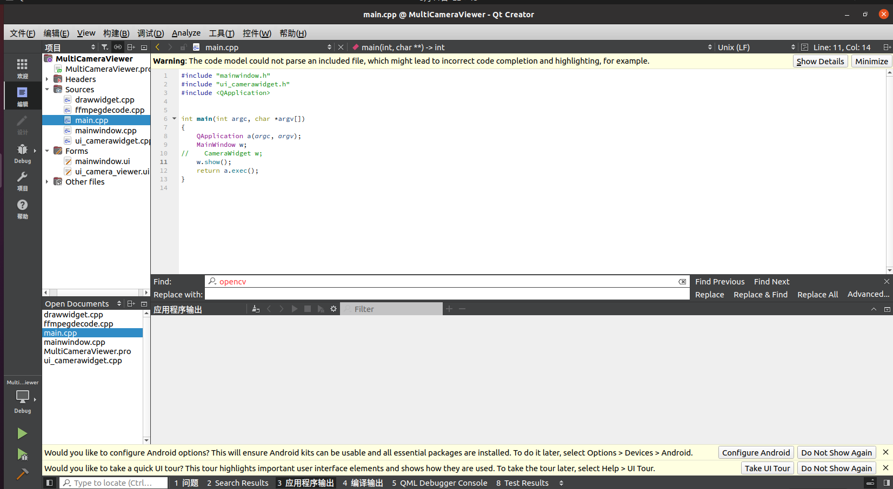
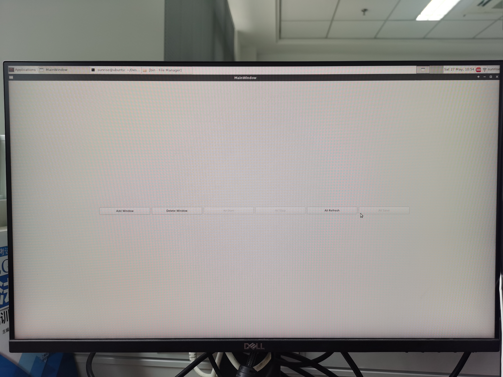
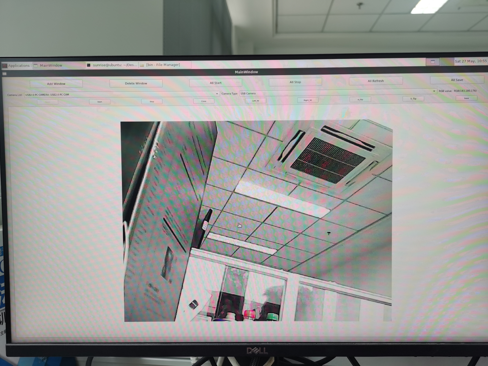

# 【QT基础示例2】gcc9.3.0-QT5.12.12 USB相机示例

# 一、前言

基于QT5.12.12框架实现了一个简单的USB摄像头预览程序，本来准备用于X3pi上的多摄采图（在程序中也有体现，最多可以开4个摄像头），后面发现X3pi的usb控制器只有一个，最多只支持一个USB相机，遂寄，该示例仍可作为基础性的X3pi QT应用示例。

# 二、环境设置

QT交叉编译及环境设置请参考：[https://developer.horizon.ai/forumDetail/146176821770230202](https://developer.horizon.ai/forumDetail/146176821770230202)

需要将编译第一个QT程序跑通

# 三、代码解析

代码文件路径主要如下所示：

```jsx
MultiCameraViewer_arm
         --- ffmpeg-arm 为x3pi交叉编译的ffmpeg库
				 --- MultiCameraViewer 为窗口界面主程序源码
						 --- drawwidget.cpp 可交互图像显示窗口 InteractiveView
             --- ffmpegdecode.cpp ffmepg解码类FFmpegDecode
						 --- main.cpp 主程序
             --- mainwindow.cpp 主程序窗口
             --- ui_camerawidget.cpp 多摄处理窗口 CameraWidget
```

整个代码的逻辑比较简单，就是通过ffmpeg打开usb摄像头取图，并显示在InteractiveView，InteractiveView是自定义的一个类，用于显示图像、缩放、保存等。

# 四、编译及运行

解压MultiCameraViewer_arm.tar.xz，并在ubuntu20.04宿主机中使用QT creator打开MultiCameraViewer-MultiCameraViewr.pro，打开项目后如下所示：



**注意打开后要选择配置好的交叉编译工具链作为代码的编译工具，否则会编译失败**

## 3.1 运行前的准备

本工程采用QT自带的远程部署方式将ffmpeg库直接发送到板端/opt目录下，在pro文件中添加如下描述即可指定要发送的文件夹：


添加后，在项目的Run中会自动出现发送的库链接，此处会将项目的执行文件和库发送到/opt目录：


完成库发送后，需要在板端的变量中添加查找库的路径，如下图所示：


```jsx
LD_LIBRARY_PATH  /opt/MultiCameraViewer/lib/lib
```

## 3.2 运行

完成设置后，点击运行按钮，相机示例即可在宿主机端显示，点击Add Window添加USB窗口：


选择识别到的USB相机，点击Open和Start即可预览图像，此外在图像处右击可以保存图像旋转图像等，由于是通过x11 forwarding投影到宿主机端进行显示的，画面会比较卡顿，实际使用最好还是在hdmi上运行


## 3.3 板端hdmi直接运行

如前面所述，程序已经通过qt creator发送到了板端，在板端                                                           控制台中输入如下语句即可在板端hdmi直接运行

```jsx
export LD_LIBRARY_PATH=$LD_LIBRARY_PATH:/opt/MultiCameraViewer/lib/lib
/opt/MultiCameraViewer/bin/MultiCameraViewer
```

输入按下图所示：


启动后如下图所示：



预览：


